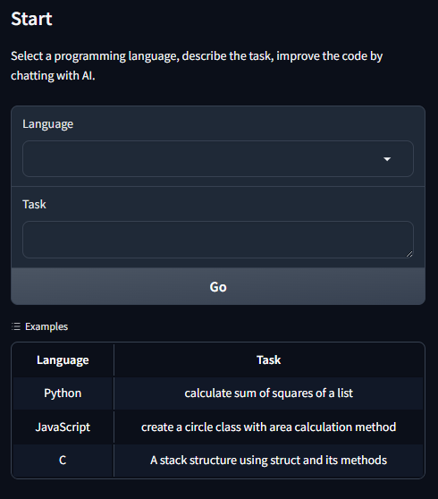
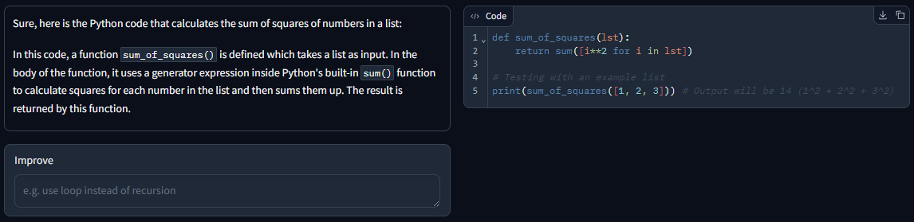
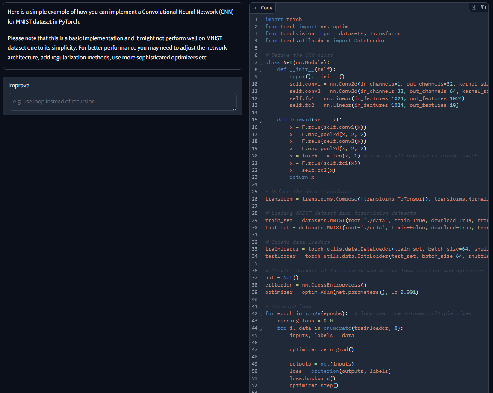

# CodeG
CodeG is yet another LLM based code generator. However instead of creating code snippets inside
a chat conservation it has a dedicated code description and actual code panels. Everything is done locally, so 
nothing leaves your computer.

## Description
For privacy concerns, It's meant to be used with:
* Local PC
* Windows OS
* CPU

For this purpose, it uses optimized GGUF model files, which are converted from open LLM models. 
## Installation
To install the application, follow the steps below:
### Prerequisites
- At least Python 3.10 installed on your system (tested with 3.10)
- pip package manager installed. (It usually comes bundled with Python.)
- Internet connection to install dependencies.
### Steps
1. Clone the repository or download the source code.
```git clone <repository_url>```
2. Navigate to the project directory
```cd <project_directory>```
3. Adapt the ```config.yml``` configuration database file. By default, **q8_0** variant of **Magicoder-S-DS-6.7B** model
is selected. You can check [TheBloke](https://huggingface.co/TheBloke)'s page for all the optimized models. When selecting a model, be sure that your PC meets "Max RAM required" in the model card.
A very important setting is the context length. When it's 0, it uses maximum context length of the model.
Higher context length means, higher number of input sequences can be given to the model, and higher number of output sequences can be generator.
When we are improving the code, be aware that we feed the current code to the model.
Whether large of short text is given, higher context length will result lower performance.
4. Start the application by:
- ```start.bat```. 
  - This script will create the new virtual environment and install necessary libraries for Windows.
  - It'll spawn the gradio application and open the local web application with the default browser automatically.
- <b>NOTE:</b> If you update the software by pulling new resources, delete the ```myvenv``` folder to for the script to install new requirements.

## Usage
### Boot Screen
* Select a language
* Describe the task. 
  * You can also try the provided examples by clicking them.
* Click "Go".

* 
### Improvement Screen
* Application will use the selected LLM to generate code for the given task and language.
* When doing this, the description and code will be in seperated panels.

* With the code generated on right, now you can improve it, by describing what's necessary via Improve input.
* A longer example, MNIST training.

## Contact
For problems, ideas, discussions etc. You may contact me at aliakyurek@gmail.com

## License
MIT